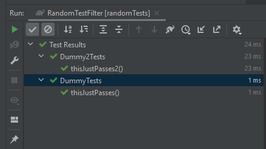

# JUnit 5 - Random Test Filter

This filter enables a randomized subset of tests to be executed. The filter is only takes effect when a limit is 
configured via a system property doesn't interfere with test configurations. This filter requires JUnit 5.

## Gradle - Quickstart

The following shows how to apply and configure the filter using Gradle. 

1. Include the library in your source. E.g. in your `build.gradle.kts` add the following:
```kotlin
repositories {
    mavenCentral()
}

dependencies {
    testRuntimeOnly("nz.cheyne.junit.RandomTestFilter")
    testRuntimeOnly("org.junit.jupiter:junit-jupiter-engine:5.8.2")
}
```
2. To register the filter create the resources file `META-INF/services/org.junit.platform.launcher.PostDiscoveryFilter` with the following contents:
```
nz.cheyne.junit.RandomTestFilter
```
3. Set the system property `nz.cheyne.junit.test.limit` to limit the number of tests run. Note, if the limit  is not set
the filter will be active. An example of how this may be configured this in a `build.gradle.kts` is shown below:
```kotlin
tasks.create<Test>("randomTest") {
    group = "verification"

    // Limit the number of tests executed to 2
    val limit: String = System.getProperty("test.limit") ?: "2"
    systemProperty("nz.cheyne.junit.test.limit", limit)
    include("**/Dummy**")
}
```
With the above configuration, the property can be overridden on the commandline, e.g. 

```./gradlew -Dtest.limit=3 randomTest ```

## Advanced usage

The execution order of tests can be changed the JUnit5 properties `junit.jupiter.testmethod.order.default` and 
`junit.jupiter.testclass.order.default`. The random seed can be is logged at INFO level from the filter, but it is noisy
with Gradle because all tasks must log at that level. Instead, it is convenient to log it at the `QUIET` level in the 
Gradle build. Finally, we can restrict the tests that are run by the task using standard `include` and `exclude` patterns.
An example is shown below:

```kotlin
tasks.create<Test>("randomTest") {
    group = "verification"
    
    val limit: String = System.getProperty("test.limit")
    systemProperty("nz.cheyne.junit.test.limit", limit)

    // Set the random seed for JUnit and the RandomTestFilter. 
    val seed: String = System.getProperty("junit.jupiter.execution.order.random.seed") ?: kotlin.random.Random.nextLong().toString()
    systemProperty("junit.jupiter.execution.order.random.seed", seed)
    
    // Randomize the order that individual tests are run
    systemProperty("junit.jupiter.testmethod.order.default", "org.junit.jupiter.api.MethodOrderer\$Random")
    // Randomize the order that test classes are run.
    systemProperty("junit.jupiter.testclass.order.default", "org.junit.jupiter.api.ClassOrderer\$Random")
    
    // Only run tests that match this filename pattern
    include("**/Dummy**")

    // As convenience, we can set and log the seed in the task.
    doFirst {
        logger.quiet("junit.jupiter.execution.order.random.seed is {}", seed)
    }
}
```

## Repeating a test

The above test execution can be repeated with the same seed as follows: 

```./gradlew -Djunit.jupiter.execution.order.random.seed=5204161256085625141 randomTest```

## Contributing

This is a pretty simple project (single class). 

### Testing

A small set of unit tests that check the filtering can executed with the standard `test` tasks. The `randomTest` test
needs to be run manually to verify the functionality of the filter.

